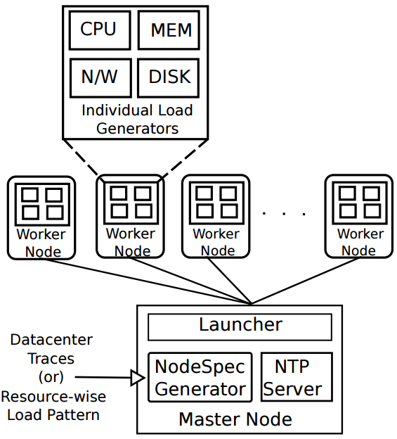

# Xerxes: Distributed Load Generator for Cloud-scale Experimentation

Xerxes is a distributed load generation framework that can generate desired CPU and memory consumption patterns across a large number of machines. It is organized as a collection of individual load generators, one per machine, coordinated via a master node. It can be used to replay traces from datacenter machines, generate loads fitting statistical distributions and generate resource usage spikes, all at varying scales. The accuracy of aggregate resource consumption patterns decays gradually in line with the rate of experimentation node failures. This lets datacenter/cluster administrators and researchers achieve highly scalable load testing without having to deal with application logic specific nuances.

  

## Installation

1. Worker nodes need to be installed with the following items from the benchmark tarball:

* `<xerxesroot>/loadgen/wileE`
* `<xerxesroot>/master/launcher/setupcron.sh`

Please ensure that both of these files are in the same location in each worker node. To generate the `wileE` binary, just navigate to `<xerxesroot>/loadgen/` and hit `make`. For specifics on how to use shipfiles.py please refer to the next section.

*Dependencies:*

* GNU C Library (glibc)
* GNU C Compiler (gcc)

2. Master node needs the entire components of the xerxes tarball on a local directory.

*Dependencies:*

* Python
* NumPy for Python

3. For more details on how Xerxes can be used to generate CPU and memory load across a cluster of machines, please refer to the user guide and paper in the `docs` section.
